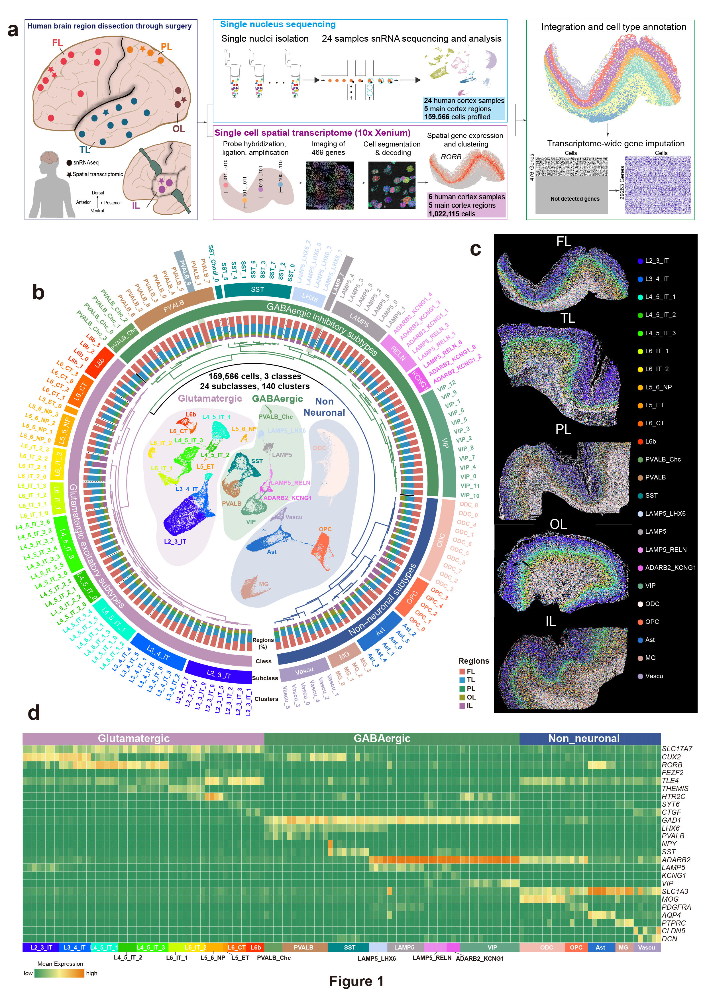

# Human_Cortex_Atlas

 
#  Unveiling Molecular and Spatial Signatures of Regional Variations in the Human Brain.

 

 

#### Abstract
Evolutionary adaptations in the human cerebral cortex have contributed to our advanced cognitive abilities, yet the spatial organization and regional diversity of cell types within this complex structure remain inadequately understood. In this study, we present a comprehensive transcriptomic and spatial cell-type atlas of the adult human cortex, integrating single-nucleus transcriptomes and spatially mapping over 1 million cells across 24 cortical regions. Our analysis reveals a higher neuron density in the frontal and temporal lobes, associated with region-specific genes linked to advanced cognitive functions. We identify a unique, region-specific GABAergic neuron subtype (GAD1/2+LAMP5+ MEIS2+) that playa a critical role in cortical functionality and observe distinct regional differences in oligodendrocyte maturation. Additionally, we identify a human-specific subtype of Layer 4/5 IT neurons that is absent in mice, highlighting species-specific cortical specialization. Furthermore, we trace genetic programs that maintain regional identity from development through adulthood and explore the connections between neurological diseases, cell types, and brain regions. This study significantly advances our understanding of the cellular and molecular mechanisms underlying human cortical regional specialization.

 

  
 

 

#### Links
- **<a href="http://wanglaboratory.org/" target="_blank"> Wang Lab Website</a>**
- The raw data is available to download under the GSA number **<a href="https://ngdc.cncb.ac.cn/gsa-human/s/zfNjgA21" target="_blank"> HRA005677 </a>**.
- The metadata of human adult cotex samples is available to download **<a href="http://wanglaboratory.org/data/whole_embryo/metadata/Adult_metadata.csv" target="_blank"> HERE</a>**

 
